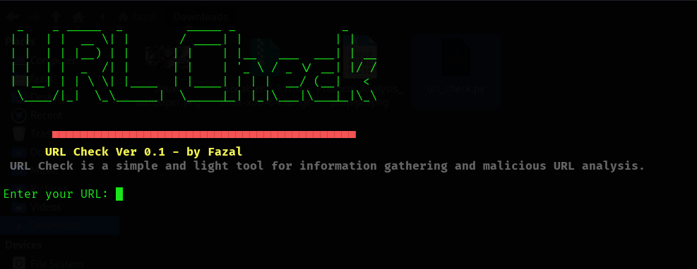

# 🔍 URL Check

**URL Check** is a simple and lightweight tool for information gathering and malicious URL analysis using the VirusTotal API.



---

## 🛠️ What is URL Check?

**URL Check** is a command-line tool designed for security professionals and developers to analyze suspicious URLs. It leverages [VirusTotal](https://www.virustotal.com/) to return detailed threat intelligence about any given URL.

---

## 🚀 Features

- 🧠 Malicious URL Detection  
- 📊 Engine-wise Detection Reports  
- 💡 Detection Summary Statistics  
- 💻 Cross-Platform Support  
- 🎯 Minimal Setup  
- 🔁 Interactive Scanning Loop

---

## 📥 Information Collected

When a URL is submitted, URL Check returns:

- ✅ Harmless Count  
- ❗ Malicious Count  
- ❓ Suspicious Count  
- 🔍 Undetected Count  
- ⏳ Timeout Count  
- 🧰 Per-Engine Category, Method & Result

---

## 🧪 Tested On

- Kali Linux  
- Ubuntu  
- Parrot OS  

## 📦 Installing URL Check

```
`git clone https://github.com/shaikfazal-del/url-check.git 
cd url-check 
python3 url_check.py`
```
---

## 🔐 Setup Your VirusTotal API Key

Follow the steps below to generate your API key and integrate it with the script.

### 🛡️ Step 1: Get Your API Key

1. Go to [https://www.virustotal.com/gui/home/upload](https://www.virustotal.com/gui/home/upload)
    
2. Sign in or create a new account
    
3. Navigate to [https://www.virustotal.com/gui/my-apikey](https://www.virustotal.com/gui/my-apikey)
    
4. Copy your **public API key**
    

### 🧑‍💻 Step 2: Add API Key to Script

1. Open Terminal:
    
    `cd ~/Downloads    # or the folder where script is located nano url_check.py`
    
2. Find the line:
    
    `API_KEY = ""`
    
3. Paste your API key:
    
    `API_KEY = "your_actual_api_key_here"`
    
4. Save and exit:
    
    - Press `Ctrl + O`, `Enter`, and `Ctrl + X` in Nano
        
    - Or use `Ctrl + S` in GUI editors
        

### ▶️ Step 3: Run the Tool


```
python3 url_check.py
```

---

## 🧪 Example Output

```
Enter your URL: http://example.com Waiting for analysis to complete... \ Analysis completed! 
--- URL Analysis Summary --- 
Submitted URL: http://example.com 

Detection Stats: 
- Harmless:   87  
- Malicious:  0  
- Suspicious: 0 
- Undetected: 3  
- Timeout:    0 
- Do you need Search Engine data (1 for Yes, 0 for No): 1
- --- Engine-wise Detection Results ---
- [Engine: AVG]   
- Category: undetected   
- Result:   None  
- Method:   static
```

---

## 📄 Disclaimer

> This tool is developed strictly for educational and penetration testing purposes.  
> The developer is not responsible for any misuse. Use responsibly and legally.

---

## 📣 Stay Connected

- **Author:** Fazal
    
- **GitHub:** [@shaikfazal-del](https://github.com/shaikfazal-del)
